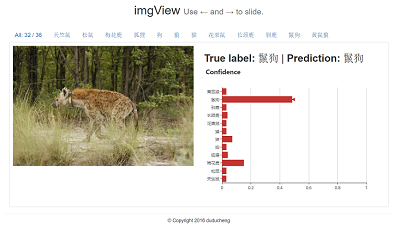

# imgView: View Your Deep Conv Nets' Prediction (**zero dependancy**)
**Note**: It's a tool to *"view"*, without ability to predict. You should provide the results, maybe from a Deep Neural Networks; and imgView help you show the results.

# Preview an interactive page [here](https://duducheng.github.io/imgView/index.html#/)
<p align="center">
  
</p>

Tested for Python 2 (not tested for Python 3).

If you want to use it in Python 3, you can directly use imgView.js, or write your own wrapper.

# Usage
```python
from imgView import imgViewer
jsonfile='cn_test.json'
img_dir='../test_imgs/'

viewer = imgViewer(img_dir=img_dir,jsonfile=jsonfile)
viewer.serve()
# Find app running on http://localhost:9000/
viewer.kill() # kill the subprocess
viewer.remove() # clean the cache
```
or use the dataframe API from pd_utils
```python
from imgView.pd_utils import dfViewer
# test_df = pd.DataFrame(...)
viewer = dfViewer(test_df, img_dir="../test_imgs/")
# Find app running on http://localhost:9000/
viewer.clear() # kill the subprocess, and clean the cache.
```

# [imgView.js](imgView.js/)
Angular and Echarts frontend source.
You can develop your own frontend. If you just want to use the python API, you can even delete this folder.

# LICENSE
MIT
